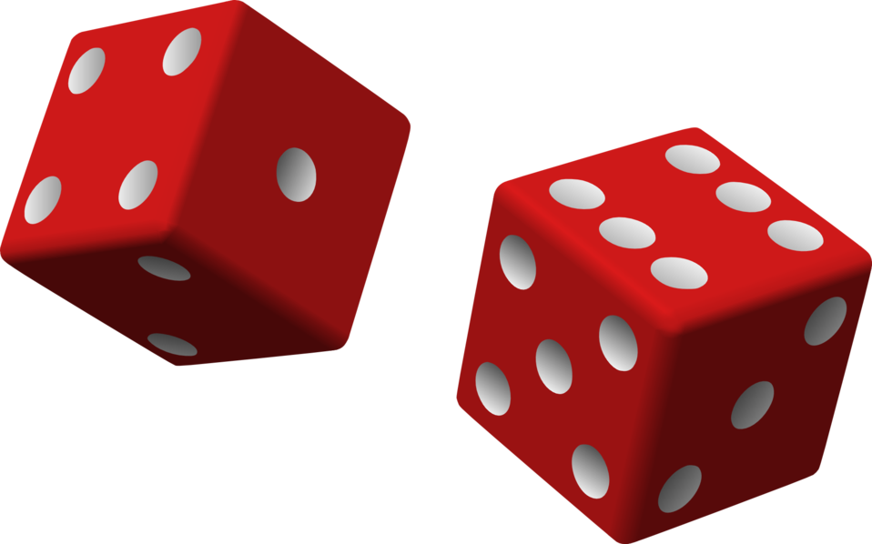

# Games of chance

This is a collection of games of chance, including:
  * Dice rolling game that plots a histogram of the results
  * [Cho-Han](https://en.wikipedia.org/wiki/Ch%C5%8D-han)
  * Coin flipper

   
  

## Languages and packages
To run these programs you will need Python3 and the following packages:
  * numpy
  * matplotlib
  * random
